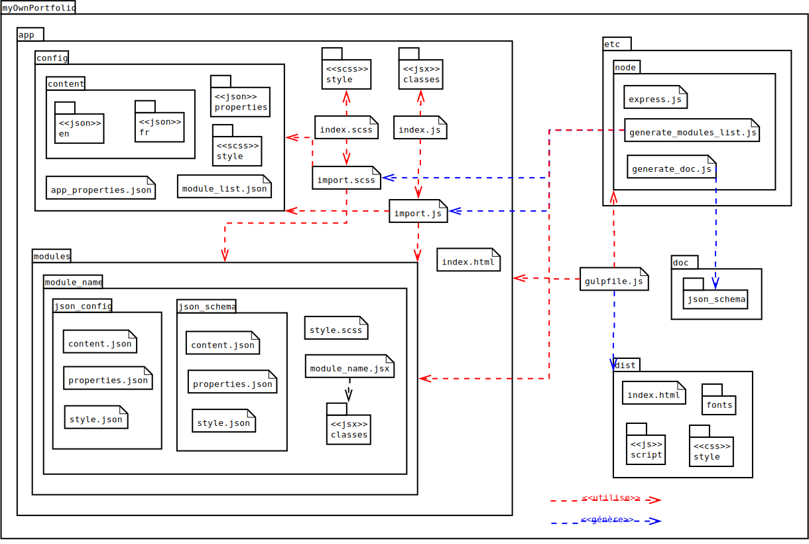

# myOwnPortfolio (WORK IN PROGRESS)
__Auteur__: [Thibault THÉOLOGIEN](https://github.com/MacBootglass/)

__Langues__: [FR](./README.md) - [EN](./README_EN.md)

[](https://www.codacy.com/app/thibault-theologien/myOwnPortfolio?utm_source=github.com&utm_medium=referral&utm_content=MacBootglass/myOwnPortfolio&utm_campaign=badger)
[](https://travis-ci.org/MacBootglass/myOwnPortfolio)


## Description du projet
Permet la création et le déploiement rapide d'un portfolio personnalisé et multilingue.

Cliquez __[ici](https://macbootglass.github.io)__ afin de visualiser un exemple de rendu possible.

Une présentation Reveal.js du projet est disponible __[ici](http://macbootglass-presentations.azurewebsites.net/presentations/myOwnPortfolio/#/)__.

__[Documentation des schemas JSON](http://macbootglass.github.io/myOwnPortfolio/docs/json_schema/index.html)__

__[TodoList](https://github.com/MacBootglass/myOwnPortfolio/projects/1)__

__[Issues](https://github.com/MacBootglass/myOwnPortfolio/issues)__

## Pré-requis
### Minimaliste:
- [Docker](https://docs.docker.com)
- [docker-compose]() _(préférable mais non obligatoire)_

### Optimal:
- [npm](https://docs.npmjs.com)
- [nodejs](https://nodejs.org/en/)
- [gulp](http://gulpjs.com)
- [sass](http://sass-lang.com)
- [json-sass](https://github.com/vigetlabs/sass-json-vars)
- [browserify](http://browserify.org) _(optionnel)_

__NOTE__: L'utilisation de docker n'est pas requise avec cette configuration


## Fonctionnement
Le répertoire [app/config](./app/config) contient l'ensemble de la configuration des modules du site, et donc du site en lui même.

C'est dans le fichier [app/config/modules_list.json](./app/config/modules_list.json) que sont spécifiés tous les modules utilisées, ainsi que les liens vers leurs fichiers de configuration.

Il est important de noter que tous les fichiers JSON utilisées doivent répondre à un schéma JSON prédéfini (utilisation des normes [suivantes](http://json-schema.org/examples.html)). Vous pouvez en consulter la liste [ici](./doc/json-schemas).


## Compilation
Un répertoire `dist` contenant l'ensemble des fichiers du site sera généré.

### Configuration minimaliste
#### Avec Docker
- Création et lancement du container permettant la compilation:
```bash
$ docker run --name=compile_myownportfolio --volume=$(pwd):/root/project -it macbootglass/myownportfolio bash compile.sh
```

- Création et lancement du container permettant le lancement du serveur web sur le port 3000, et donc de visualiser l'affichage:
```bash
$ docker run --name=start_server_myownportfolio --volume=$(pwd):/root/project -it macbootglass/myownportfolio bash start_server.sh
```

#### Avec docker-compose
- Création et lancement des deux containers ci-dessus:
```bash
$ docker-compose up -d
```

#### Dans les deux cas
- Vous pouvez relancer les container par le biais de la commande:
```
$ docker start $container_name -d
```
(avec `$container_name` valant `compile_myownportfolio` ou `start_server_myownportfolio`).

#### Note
L'image [docker utilisée](https://hub.docker.com/r/macbootglass/myownportfolio/) est disponible [ici](./tools/Dockerfile) et peut être construite localement par le biais de la commande suivante:
```bash
$ docker build ./tools/Dockerfile/Dockerfile -t macbootglass/myownportfolio:latest
```

### Configuration optimale
```bash
$ npm install
$ gulp
```


## Déploiement
Plusieurs options sont maintenant possibles:
- déployer cette archive sur [github pages](https://pages.github.com)
- déployer cette archive sur un serveur web personnel
- lancer le site web en local (localhost:3000)


## Contexte du projet
Pour tout étudiant, il est intéressant de disposer d'un site web faisant office de portfolio.

Cependant, même si l'on dispose des connaissance en informatique nécessaires à sa création, ce travail peut être long et fastidieux.

Le but de ce projet est donc de faciliter cette étape de création en demandant uniquement à l'utilisateur de compléter des fichiers au formats JSON.
Ces derniers spécifient les modules que le site contiendra (barre de navigation, bouton de téléchargement de fichiers, ect ...) ainsi que leur contenu textuel. Plusieurs langues peuvent également être définies par l'utilisateur.

Pour les plus aguerris, il est possible de redéfinir l'apparence de certaines parties du site, et ce toujours à partir de fichiers JSON, mais aussi de participer au développement en créant de nouveaux modules (l'ensemble du projet étant codé en React, leurs intégration est aisée).


## Arborescence
_Diagramme de package:_ (__deprecated__)



## Liste des modules
### [navbar](./app/modules/navbar/)


Ce module permet l'affichage d'une barre de navigation référençant l'ensembles des modules dont l'attribut `referenced` vaut `true`dans le fichier [modules_list.json](./app/config/modules_list.json).

Lors de l'affichage sur mobile (résolution < 900px), des icônes déterminés dans le fichiers [properties.json](./app/modules/navbar/json_config/properties.json) sont affichés à la place du nom de module à afficher. Ces icônes sont référencés à l'aide de noms de classes de la libraire [font-awesome](http://fontawesome.io/icons/).

Lors d'un scroll vers le bas de l'écran, la barre de navigation disparait automatiquement, et réapparait lors d'un scroll vers le haut.

### [home](./app/modules/home)


Ce module permet l'affichage d'un écran d'accueil. Il dispose d'un fond animé (par le biais de la librairie [particlesjs](https://github.com/marcbruederlin/particles.js)), d'une photo centrale (de préférence celle de l'utilisateur) ainsi qu'une zone de texte  animée, apparaissant et disparaissant de manière dynamique, comme si quelqu'un était en train de taper le texte à l'écran.

Un bouton permet de passer au module suivant à l'aide d'un scroll automatique.

Tous ces contenus sont bien entendu personnalisables.

### [about](./app/modules/about)


Ce module permet à l'utilisateur de se décrire un peu plus en détails. On retrouve donc un titre (ayant pour vocation initiale d'accueillir le nom de l'utilisateur) et un block de texte central (pour la description). Une liste d'images redirigeant vers des uri définies peuvent également être affichées. Elle permettent par exemple une redirection vers un profil LinkedIn ou GitHub. Un dernier bouton permet une redirection vers le téléchargement du CV de l'utilisateur.

### [map](./app/modules/map)


Ce module permet à l'utilisateur d'afficher une carte du monde de type planisphère et d'un indiqué tous les lieux qu'il a pu visiter.

### [project_list](./app/modules/project_list)


Ce module permet à l'utilisateur de générer une liste de projets sur lesquels il a pu participer. Sur le rendu de chacun de ces projets, il faut  indiquer un titre, une courte description ainsi qu'un bouton (optionnel) de redirection vers le projet en question.

### [skill_list](./app/modules/skill_list)


Ce module a pour vocation de lister les compétences de l'utilisateur, selon des catégories qu'il aura lui même défini. Pour ces compétences, l'utilisateur devra systématiquement indiquer un nom et un niveau ([0;100]). Une animation faisant croitre la barre de progression de 0 jusqu'au niveau indiqué par l'utilisateur sera exécuté lors de l'apparition à l'écran du module (par le biais de la librairie [react-on-visible](https://github.com/dazld/react-on-visible)).

### [rubric](./app/modules/rubric)


Ce module permet à l'utilisateur de rédiger des rubrics comprenant un titre global ainsi que des articles.

Pour chacun de ces articles, l'utilisateur doit saisir une liste de blocs comprenant un titre ainsi qu'un contenu textuel (supporte le format markdown grâce à la librairie [react-markdown](https://github.com/rexxars/react-markdown)).

Une timeline est automatique générée sur le côté de ces articles. L'utilisateur peut ainsi indiquer une date à côté des articles (non présente sur mobile).

### [footer](./app/modules/footer)


Ce module permet d'indiquer toutes les références que l'utilisateur pourrait souhaiter voir présentes dans un pied de page (copyright, ...).

Le module est découpé en deux partie textuelles (droite et gauche) supportant toutes deux le format markdown (grâce à la librairie [react-markdown](https://github.com/rexxars/react-markdown)).

Un bouton au centre du module permet de remonter en haut de l'application web.


## Librairies utilisées

### [Timelined](https://github.com/andriussev/timelined)
Permet l'affichage d'une timeline. Est utilisé dans le module [rubric](./app/modules/rubric).

### [ajv](https://github.com/epoberezkin/ajv)
Permet la validation des schémas JSON. Est utilisé par le script de génération [generate_modules_list.js](./tools/node/generate_modules_list.js).

### [aos](https://github.com/michalsnik/aos)
Permet l'ajout d'animations de l'apparition à l'écran de balises HTML déterminées. Pour plus de détails cliquez [ici](https://michalsnik.github.io/aos/).

### [bootstrap](https://github.com/twbs/bootstrap)
Permet l'ajout de styles CSS préconfigurés. Pour plus de détails cliquez [ici](https://v4-alpha.getbootstrap.com).

### [docson](https://github.com/lbovet/docson)
Permet la génération de la documentation pour les schémas JSON.

### [express](https://github.com/expressjs/express)
Permet le lancement d'un serveur web minimaliste sur la machine hôte.

### [font-awesome](https://github.com/FortAwesome/Font-Awesome)
Permet l'ajout de nombreux icônes. Est notamment utilisé dans le module [navbar](./app/modules/navbar) lors de l'affichage mobile. Pour plus de détails sur son utilisation cliquez [ici](http://fontawesome.io).

### [headroom.js](https://github.com/WickyNilliams/headroom.js)
Permet de gérer l'apparition (affichage) du module [navbar](./app/modules/navbar) en fonction de l'utilisation de la barre de scroll sur le site généré.

### [particlesjs](https://github.com/marcbruederlin/particles.js)
Permet l'affichage d'un fond animé. Est utilisé dans le module [home](./app/modules/home)

### [rc-progress](https://github.com/fis-components/rc-progress)
Permet l'affichage de barre de progression dynamiques. Est utilisé dans le module [skill_list](./app/modules/skill_list).

### [react-d3-map](https://github.com/react-d3/react-d3-map)
Permet l'affichage d'une carte du monde. Est utilisé dans le module [map](./app/modules/map).

### [react-helmet](https://github.com/nfl/react-helmet)
Permet de modifier le contenu du block `<head>`.
Ainsi, il est possible de modifier la balise `<title>` (nom dans l'onglet) ou encore le favicon à partir du fichier de configuration [app_properties](./app/config/app_properties.json).

### [react-markdown](https://github.com/rexxars/react-markdown)
Permet le rendu de contenu textuel au format markdown. Est utilisé dans les modules [rubric](./app/modules/rubric) et [footer](./app/modules/footer).

### [react-on-visible](https://github.com/dazld/react-on-visible)
Permet de lancer des événements selon le pourcentage déterminé de l'affichage d'un élément sur l'écran de l'utilisateur. Est utilisé dans le module [skill_list](./app/modules/skill_list) afin de lancer l'animation de chargement des barres de progression.

### [react-rotating-text](https://github.com/adrianmcli/react-rotating-text)
Permet le rendu de texte déterminés "comme s'ils étaient saisis en direct". Est utilisé dans le module [home](./app/modules/home)

### [slug](https://github.com/dodo/node-slug)
Permet de transformer des chaines de caractères selon la norme RFC 3986.
Cette librairie est utilisée pour la génération des ids des modules à partir du nom indiqué dans le fichier [modules_list.json](./app/config/modules_list.json) ainsi que pour les attributs keys parfois requis par ReactJS.


## Commandes gulp disponibles
* `serverStart`: Exécute la commande nodejs permettant le lancement du serveur http (utilisation de la librairie express.js) sur le port 3000.
* `build`: Lance la compilation de l'ensemble du projet.
* `watch`: Surveille les fichiers susceptibles être modifiés et relance la compilation en conséquence.
* `dev`: Exécute les commandes gulp énumérées si dessus.
