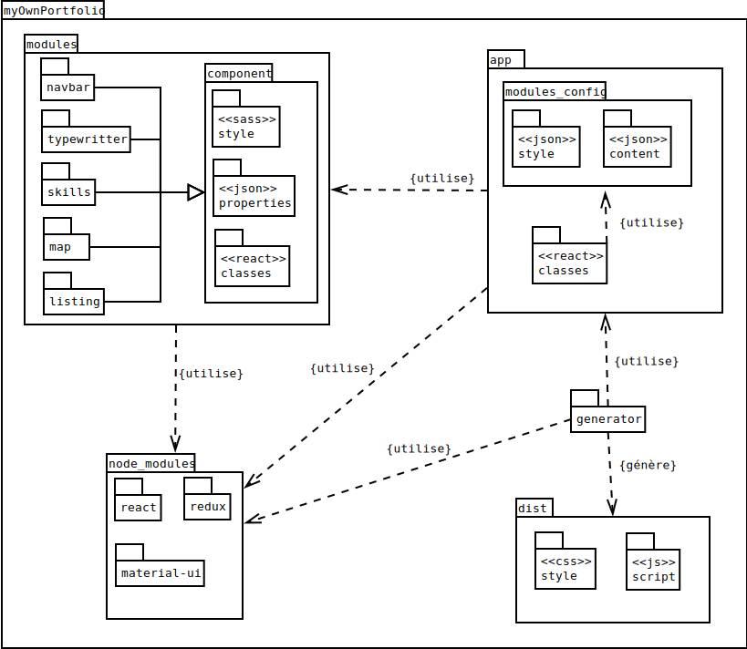

# myOwnPortfolio
[](https://travis-ci.org/MacBootglass/myOwnPortfolio)

## Description du projet
Permet la création et le déploiement rapide d'un portfolio personnalisé et multilingue.

Cliquez [ici](https://macbootglass.github.io) afin de visualiser un exemple de rendu possible.

## Contexte du projet

TODO

## Principales technologies et librairies utilisées
- [React.js]()
- [Redux]()
- [Express.js]()
- [Docker]()
- [Docker-compose]()
- [Gulp]()
- [GitFlow]()
- [Travis]()
- [Webpack]()

## Liste des modules:

 - [ ] [navbar](./modules/navbar/)
 - [ ] [typewritter](./modules/typewritter/)
 - [ ] [skills](./modules/skills)
 - [ ] [map](./modules/map)
 - [ ] [listing](./modules/listing)
 - [ ] [forkmeongithub](./modules/forkmeongithub)
 - [ ] [downloader](./modules/downloader)

__NOTE__: _Pour plus de détails sur le fonctionnement de ces modules, merci de consulter le fichier README.md présent dans chacun des répertoires des modules._

## Utilisation:

Depuis la racine du projet, lancer les commandes suivantes:
```bash
$ bash ./generator/compile.sh
```

## Diagramme de package

