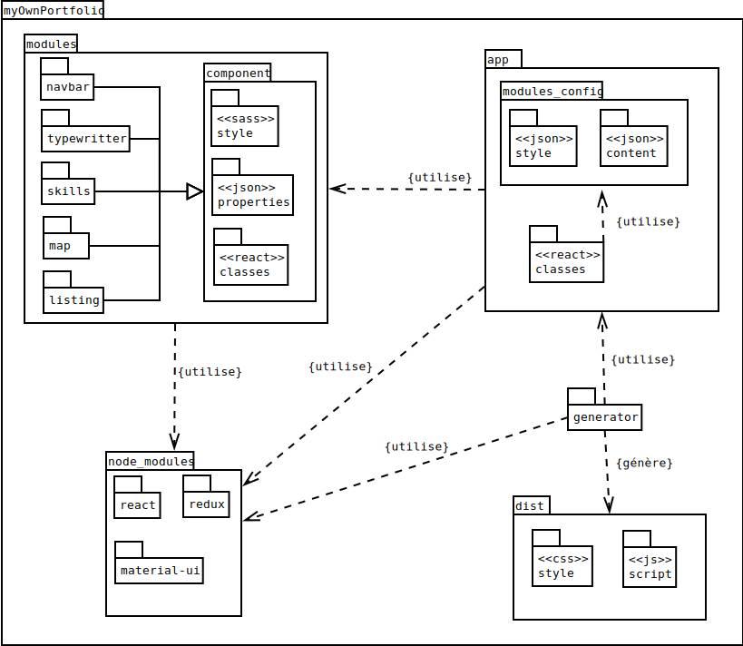

# myOwnPortfolio (WORK IN PROGRESS)
[](https://www.codacy.com/app/thibault-theologien/myOwnPortfolio?utm_source=github.com&utm_medium=referral&utm_content=MacBootglass/myOwnPortfolio&utm_campaign=badger)
[](https://travis-ci.org/MacBootglass/myOwnPortfolio)


## Description du projet
Permet la création et le déploiement rapide d'un portfolio personnalisé et multilingue.

Cliquez [ici](https://macbootglass.github.io) afin de visualiser un exemple de rendu possible.

[Documentation des schemas JSON](http://macbootglass.github.io/myOwnPortfolio/docs/json_schema/index.html)

## Pré-requis

### Minimaliste:

- [Docker]()


### Optimal:

- [npm]()
- [nodejs]()
- [gulp]()
- [sass]()
- [json-sass]()
- [browserify]()


## Contexte du projet
Pour tout étudiant, il est intéressant de disposer d'un site web faisant office de portfolio.

Cependant, même si l'on dispose des connaissance en informatique nécessaires à sa création, ce travail peut être long et fastidieux.

Le but de ce projet est donc de faciliter cette étape de création en demandant uniquement à l'utilisateur de compléter des fichiers au formats JSON.
Ces derniers spécifient les modules que le site contiendra (barre de navigation, bouton de téléchargement de fichiers, ect ...) ainsi que leur contenu textuel. Plusieurs langues peuvent également être définies par l'utilisateur.

Pour les plus aguerris, il est possible de redéfinir l'apparence de certaines parties du site, et ce toujours à partir de fichiers JSON, mais aussi de participer au développement en créant de nouveaux modules (l'ensemble du projet étant codé en React, leurs intégration est aisée).


## Arborescence
_Diagramme de package:_



## Fonctionnement et déploiement
Le répertoire [myOwnPortfolio/app/config](./app/config) contient l'ensemble de la configuration des modules du site, et donc du site en lui même.
C'est dans le fichier [myOwnPortfolio/app/config/modules_list.json](./app/config/modules_list.json) que sont spécifiés tous les modules utilisées, ainsi que les liens vers leurs fichiers de configuration.

Il est important de noter que tous les fichiers JSON utilisées doivent répondre à un schéma JSON prédéfini (utilisation des normes [suivantes](http://json-schema.org/examples.html)). Vous pouvez en consulter la liste [ici](./doc/json-schemas).

Afin de compiler le projet, il est nécéssaire d'exécuter depuis la racine du projet les commandes suivantes:
- Si docker est installé sur votre machine
```bash
$ bash ./tools/local/create_containers.sh # afin de créer les différents containers docker utilisés
$ bash ./tools/local/compile.sh # afin de lancer le container docker de compilation
```
- Si npm, gulp, sass et json-sass sont installés sur votre machine:
```bash
$ npm install
$ gulp
```

Un répertoire `myOwnPortfolio/dist` contenant l'ensemble des fichiers du site généré.

Plusieurs options sont maintenant possibles:
- déployer cette archive sur [github pages](https://pages.github.com)
- déployer cette archive sur un serveur web personnel
- lancer le site web en local (localhost:3000):
  - Si docker est installé sur votre machine:
  ```bash
  $ bash tools/local/exec.sh
  ```
  - Si nodejs est installé sur votre machine:
  ```bash
  $ node tools/node/express.js
  ```


## Liste des modules:

### [navbar](./app/modules/navbar/)


### [home](./app/modules/home)


### [about](./app/modules/about)


### [map](./app/modules/map)


### [skills](./app/modules/skills)


### [rubrique](./app/modules/rubrique)


### [footer](./app/modules/footer)


__NOTE__: _Pour plus de détails sur le fonctionnement de ces modules, merci de consulter le fichier README.md présent dans chacun des répertoires des modules._


## Librairies utilisées

### [Timelined](https://github.com/andriussev/timelined)
Permet l'affichage d'une timeline. Est utilisé dans le module [rubrique](./app/modules/rubrique).

### [ajv](https://github.com/epoberezkin/ajv)
Permet la validation des schémas JSON. Est utilisé par le script de génération [generate_modules_list.js](./tools/node/generate_modules_list.js).

### [aos](https://github.com/michalsnik/aos)
Permet l'ajout d'animations de l'apparition à l'écran de balises HTML déterminées. Pour plus de détails cliquez [ici](https://michalsnik.github.io/aos/).

### [bootstrap](https://github.com/twbs/bootstrap)
Permet l'ajout de styles CSS préconfigurés. Pour plus de détails cliquez [ici](https://v4-alpha.getbootstrap.com).

### [docson](https://github.com/lbovet/docson)
Permet la génération de la documentation pour les schémas JSON.

### [express](https://github.com/expressjs/express)
Permet le lancement d'un serveur web minimaliste sur la machine hôte.

### [font-awesome](https://github.com/FortAwesome/Font-Awesome)
Permet l'ajout de nombreux icônes. Est notamment utilisé dans le module [navbar](./app/modules/navbar) lors de l'affichage mobile. Pour plus de détails sur son utilisation cliquez [ici](http://fontawesome.io).

### [headroom.js](https://github.com/WickyNilliams/headroom.js)
Permet de gérer l'apparition (affichage) du module [navbar](./app/modules/navbar) en fonction de l'utilisation de la barre de scroll sur le site généré.

### [particlesjs](https://github.com/marcbruederlin/particles.js)
Permet l'affichage d'un fond animé. Est utilisé dans le module [home](./app/modules/home)

### [rc-progress](https://github.com/fis-components/rc-progress)
Permet l'affichage de barre de progression dynamiques. Est utilisé dans le module [skill_list](./app/modules/skill_list).

### [react-d3-map](https://github.com/react-d3/react-d3-map)
Permet l'affichage d'une carte du monde. Est utilisé dans le module [map](./app/modules/map).

### [react-markdown](https://github.com/rexxars/react-markdown)
Permet le rendu de contenu textuel au format markdown. Est utilisé dans les modules [rubrique](./app/modules/rubrique) et [footer](./app/modules/footer).

### [react-on-visible](https://github.com/dazld/react-on-visible)
Permet de lancer des événements selon le pourcentage déterminé de l'affichage d'un élément sur l'écran de l'utilisateur. Est utilisé dans le module [skill_list](./app/modules/skill_list) afin de lancer l'animation de chargement des barres de progression.

### [react-rotating-text](https://github.com/adrianmcli/react-rotating-text)
Permet le rendu de texte déterminés "comme s'ils étaient saisis en direct". Est utilisé dans le module [home](./app/modules/home)


## Commandes gulp

* `serverStart`: Exécute la commande nodejs permettant le lancement du serveur http (utilisation de la librairie express.js) sur le port 3000.
* `build`: Lance la compilation de l'ensemble du projet.
* `watch`: Surveille les fichiers susceptibles être modifiés et relance la compilation en conséquence.
* `dev`: Exécute les commandes gulp énumérées si dessus.
